# QEditor

## 简介

QEditor是我的毕业设计，它使用了AVFoundation和GPUImage2完成了一些视频编辑相关的功能。虽然由于时间的原因它并没有完全做完，但是我相信这个工程对使用AVFoundation做视频编辑相关的编程工作具备一定的参考价值。

它的整体结构如下所示，具有编辑、导入、导出和草稿四个模块。

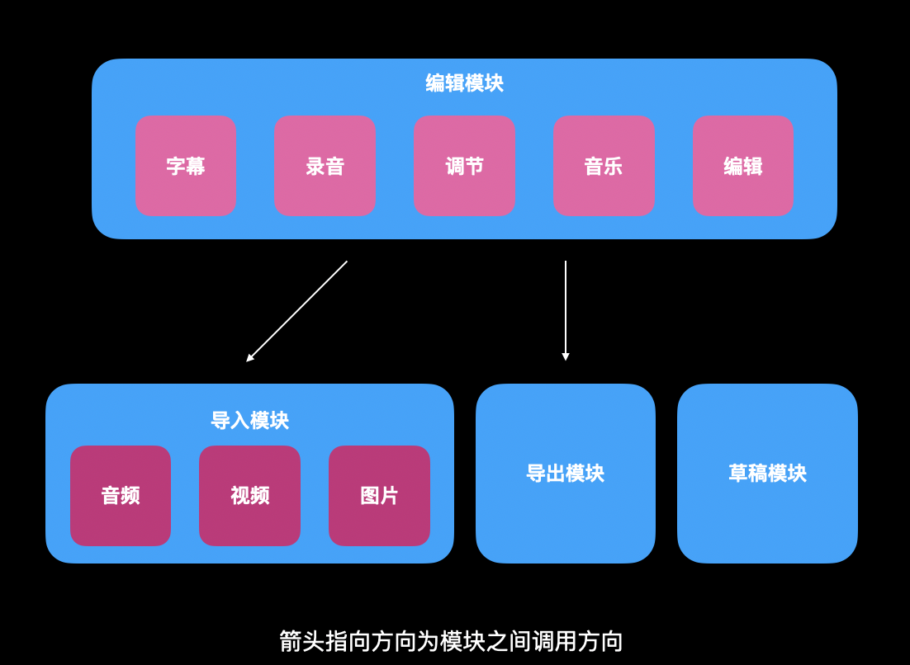

编辑模块整体样式如下，其中有剪辑、调节、音乐、录音和字幕四个子模块。

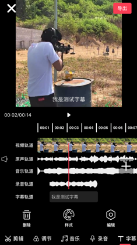

**由于兴趣转移，后续不会继续更新此工程的代码。**

## 编辑功能

本工程在视频编辑部分具备5个子模块，其中分别有数个功能。

### 剪辑

在剪辑模块中使用AVFoundation实现分割视频、删除片段、变速、倒放、转场功能。

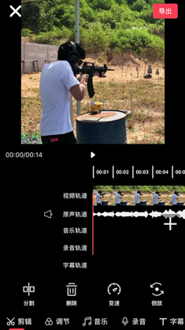

### 调节

在调节模块中使用GPUImage完成的滤镜、亮度调节、曝光调节、对比度调节和饱和度调节。

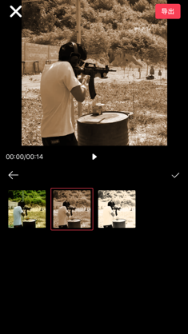

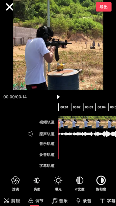

### 音乐

在音乐模块中，本工程使用了MediaPlayer来导入手机音乐库中的音频，可以对每个片段进行音量和音效的调节。

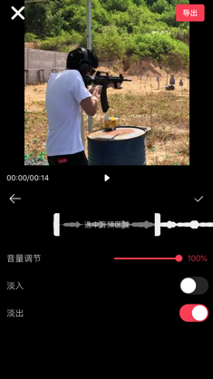

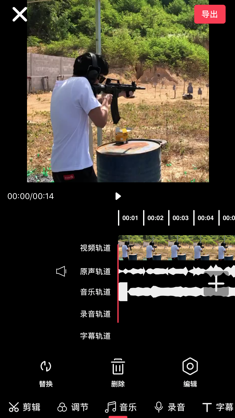

### 录音

在录音模块中使用了AVFoundation的录音功能，最后生成的音频片段与音乐功能一样都能进行音量和音效的调节。

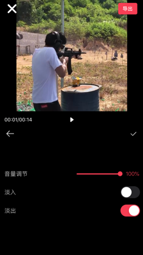

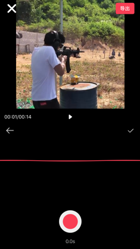

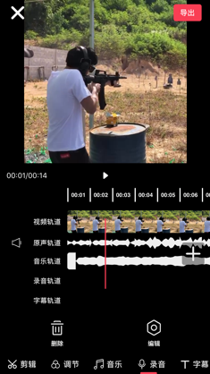

### 字幕

字幕的实现方式分为两部分，在合成前字幕是一个CATextLayer的动画，随着播放器seek而改变。在合成时用的是AVFoundation提供的导出类来合成字幕。

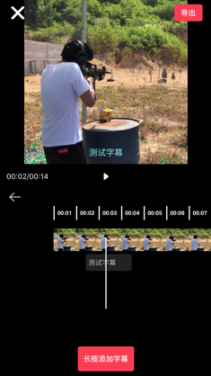

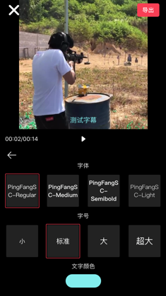

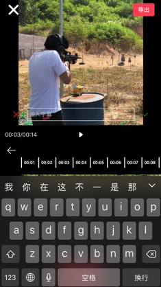

## 编辑功能服务层

在QEditor中，所有的编辑功能实际都由CompositionProject这个模块完成。它封装了AVFoundation和GPUImage2，示例结构如下图所示。它管理了视频双轨道、音频轨道、音乐轨道、录音轨道和字幕轨道，UI上的操作映射为对它的操作即可编辑资源。

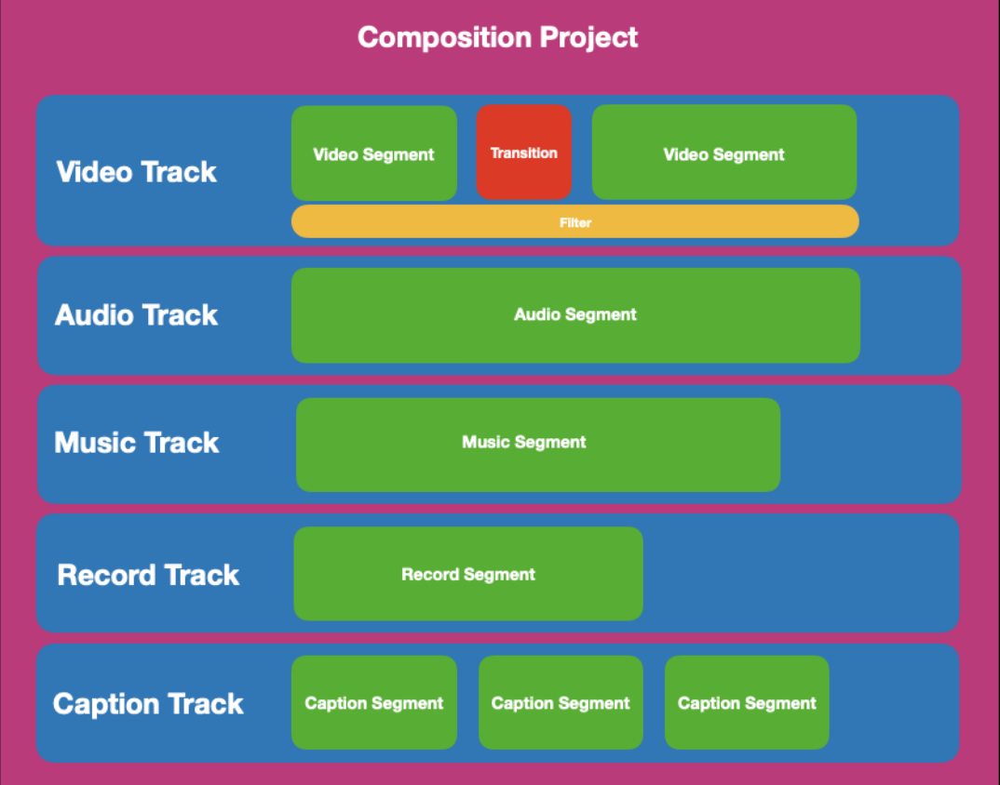

它的类图如下所示。所有的片段数据结构都需要实现CompositionSegment和CompositionSegmentCodable协议，前者是片段的一些共性而后者是为了能够让片段具备与JSON相互转化的功能。中间的CompositionProject是核心的管理类，用来提供编辑方法给外部调用，对它的操作能够将效果直接输出到CompositionPlayer中进行展示。

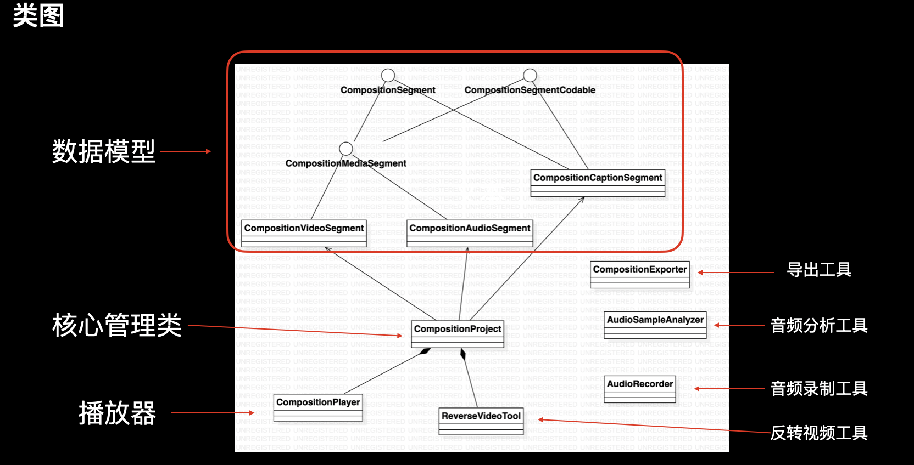

